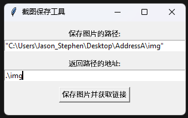

# 截图自动保存工具


## 一、工具设计原理

本项目主要为了方便截图并保存到本地用于**<u>引用</u>**到Markdown而设计，主要操作流程为，**设定**图片**保存路径**，以及返回路径的**相对**或**绝对地址**，使用任何可以将图片**存储**到**<u>剪切板</u>**的**截图工具**截图并点击“保存图片并获取链接“，即可根据**保存图片的路径**保存到指定的目录下并根据**返回路径的地址**将路径返回到剪切板中，用于快捷引入图片。



举例：

当输入框1输入为x，输入框2输入为y，图片名称为"**Screenshot%Y%m%d%H%M%S**"，则截图会保存到"**x/Screenshot%Y%m%d%H%M%S.png**"下，并返回剪切板地址如下：

```markdown

```

此时将剪切版的内容粘贴到Markdown中即可直接引用。相对路径的原理可以参考**计算机其他语言**。

Markdown的图片格式为：

```markdown

```

图片路径可为网络路径(只有能连接成功时才会显示的图片)，也可以是本地的图片路径(绝对路径或者相对路径)


## 二、项目环境以及库的需求(通过测试的版本)

### 1. Python环境以及pip版本

> Python 3.8+
>
> pip 24.0

### 2. 安装方式

安装相应的库

```powershell
pip install pyperclip
Pip install ImageGrab
Pip isntall tk
pip install datetime
```

请确保pip和python的版本相统一，使用下面的代码来寻找自己的python路径和pip路径来确定自己的版本：

```powershell
python --version
where python
where pip
```

请比对这些地方，以确保相同


## 三、项目源码

```python
import pyperclip
from PIL import ImageGrab
import tkinter as tk
from tkinter import filedialog
import os
from datetime import datetime

# Powered By GPT-3.5
# Designed By Jason_Stephen

def save_image(image, save_path):
    image.save(save_path)

def get_save_path():
    root = tk.Tk()
    root.withdraw()
    save_path = filedialog.askdirectory()
    return save_path

def get_return_path():
    root = tk.Tk()
    root.withdraw()
    return_path = filedialog.askdirectory()
    return return_path

def capture_and_save(save_path_entry, return_path_entry):
    # 从剪切板中获取图片数据
    img = ImageGrab.grabclipboard()

    # 获取保存图片的路径和返回路径的地址
    save_path = save_path_entry.get().strip('"')  # 去除额外的引号
    return_path = return_path_entry.get().strip('"')  # 去除额外的引号

    # 获取当前时间，并将其格式化为指定格式
    current_time = datetime.now().strftime("%Y%m%d%H%M%S")

    # 构建图片文件名
    image_name = "Screenshot_{}.png".format(current_time)

    # 保存图片
    image_path = os.path.join(save_path, image_name)
    save_image(img, image_path)

    # 构建返回的路径
    relative_path = os.path.relpath(image_path, return_path)

    # 构建Markdown格式的链接
    markdown_link = "".format(os.path.join(return_path, image_name))

    # 复制Markdown格式的链接到剪切板
    pyperclip.copy(markdown_link)

    # 显示提示信息
    info_label.config(text="图片已保存到: {}\nMarkdown链接已复制到剪切板: {}".format(image_path, markdown_link))

# 创建主窗口
root = tk.Tk()
root.title("截图保存工具")

# 创建输入框和标签
save_path_label = tk.Label(root, text="保存图片的路径:")
save_path_label.pack(pady=(10, 0))
save_path_entry = tk.Entry(root, width=50)
save_path_entry.pack(pady=(0, 10))

return_path_label = tk.Label(root, text="返回路径的地址:")
return_path_label.pack()
return_path_entry = tk.Entry(root, width=50)
return_path_entry.pack(pady=(0, 10))

# 创建按钮
capture_button = tk.Button(root, text="保存图片并获取链接", command=lambda: capture_and_save(save_path_entry, return_path_entry))
capture_button.pack()

# 创建提示信息标签
info_label = tk.Label(root, text="")
info_label.pack()

# 运行主循环
root.mainloop()
```


---


## 关于我的其他个人项目：

### 可进入[我的GitHub主页](https://github.com/JasonStephen)
